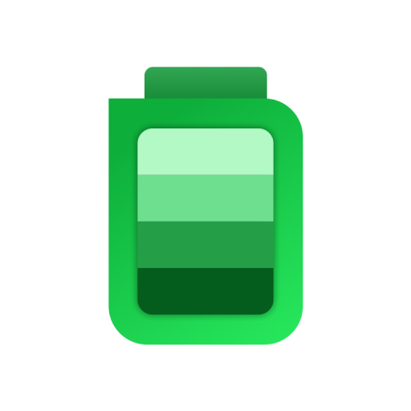
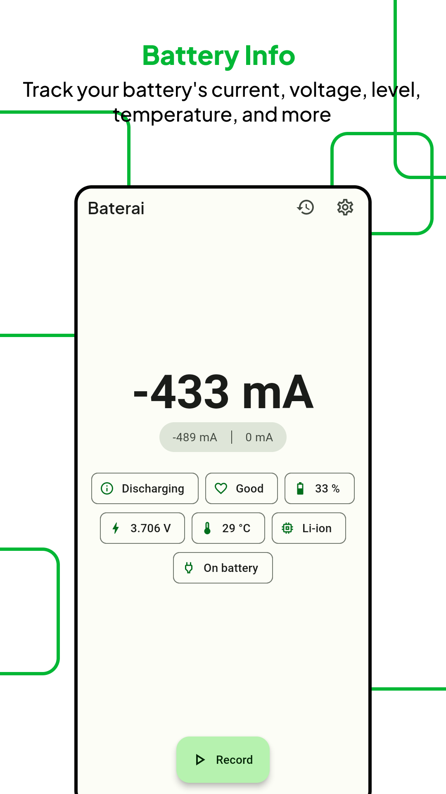
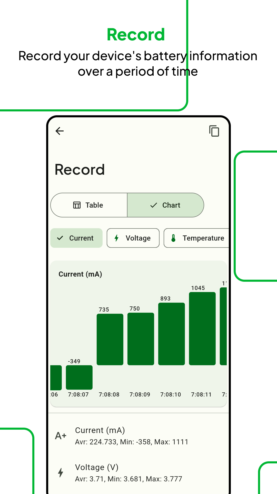
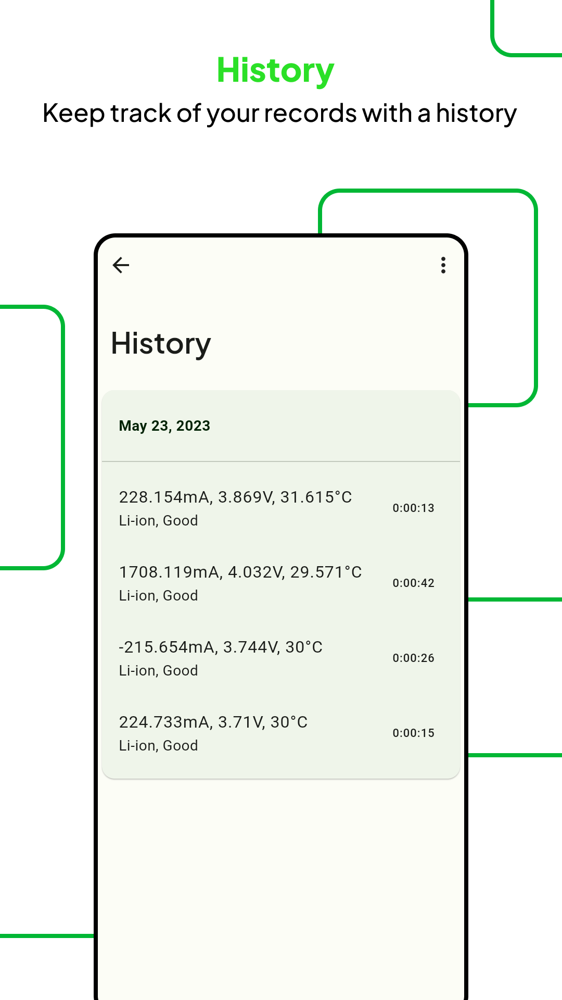
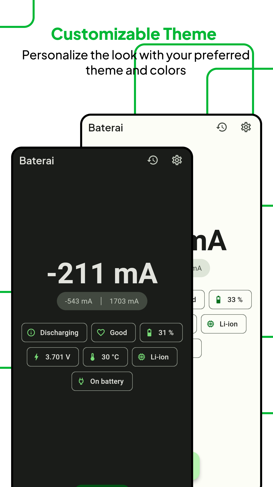

# Baterai

## Header

## Screenshot

>

## What's new

- Changed app icon
- Add more features to record page

## Description

> Play store link: [Baterai](https://play.google.com/store/apps/details?id=com.redmerah.baterai) (not available anymore)

Baterai is a powerful app that provides real-time information about your Android device's battery. With Baterai, you can track your battery's current, voltage, level, temperature, plugged status, health status, charging status, and technology.

You can also record your battery's state over time to see how it changes throughout the day. Baterai also includes a variety of settings that allow you to customize the app to your liking.

Baterai is the perfect app for anyone who wants to keep track of their Android device's battery life. With Baterai, you can easily see how your battery is performing and make changes to improve its lifespan.

Features:

- Real-time battery information
- Battery state history
- Customizable settings
